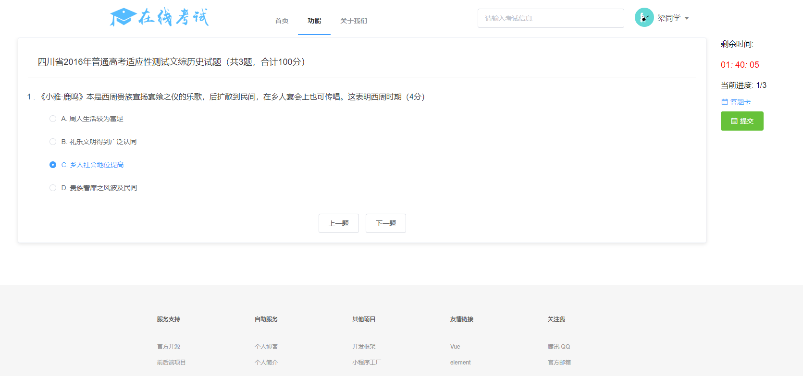
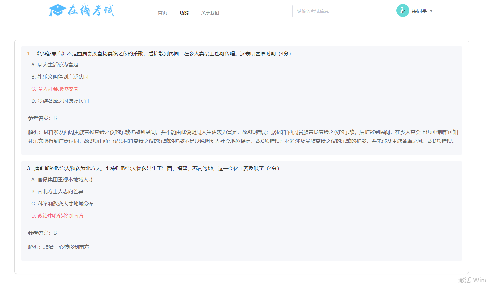
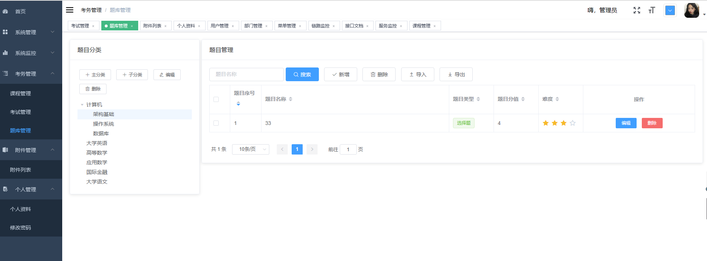

# online-exam

#### 项目介绍

利用业余时间重写毕设[spring-cloud-online-exam](https://gitee.com/wells2333/spring-cloud-online-exam)，采用前后端分离技术，前端通过token和后端接口交互。
前端采用vue2.0，后端采用spring cloud，MySQL，Redis等技术。

#### 功能概述

项目分前台网站和后台管理两部分，前台主要提供考试功能，后台提供考试管理功能。

前台主要提供在线考试、在线学习功能

后台管理分为：系统管理、系统监控、考务管理、附件管理、个人管理

系统管理：提供用户、部门、角色、权限等基础管理
- 用户管理：用户信息增删改查、导入导出
- 部门管理：部门信息增删改查
- 角色管理：角色信息增删改查、分配权限
- 菜单管理：菜单信息增删改查、导入导出

系统监控：监控服务、日志等
- 日志监控：查看系统日志
- eureka监控：eureka服务监控
- zipkin监控：监控服务的调用链路
- 服务监控：spring boot 服务监控
- 接口文档：swagger api文档

考务管理：提供课程、考试、题库、成绩等管理
- 课程管理：课程信息增删改查
- 考试管理：考试信息增删改查、题目管理、发布回收
- 题库管理：题目分类增删改查、题目信息增删改查
- 成绩管理：查看成绩、导出成绩
- 知识库：知识库增删改查、上传附件

附件管理：项目的所有附件存储在fastDfs里，提供统一的管理入口
- 附件列表：管理所有附件，如用户头像、考试附件等。

个人管理：管理个人资料和修改密码
- 个人资料：姓名、头像等基本信息的修改
- 修改密码：修改密码

#### 系统架构

待提供

#### 服务和端口

注册中心（online-exam-eureka）：8765

配置中心（online-exam-config）：8888

认证中心（online-exam-auth）：3000

用户服务（online-exam-user）：4000

考试服务（online-exam-exam）：35010

网关（online-exam-gateway）：9999

zipkin监控（online-exam-zipkin）：9411

服务监控（online-exam-admin）：5001

启动顺序：

1. online-exam-config
2. online-exam-eureka
3. online-exam-auth
4. online-exam-user
5. online-exam-exam
6. online-exam-gateway
7. online-exam-zipkin
8. online-exam-admin

#### 问题反馈

欢迎提交 issue，请写清楚遇到问题的原因，浏览器和操作系统环境，重现的流程。 如果有开发能力，建议在本地调试出出错的代码。

不接受功能请求的issue，功能请求可能会被直接关闭，请谅解。

#### 功能演示

前台

后台

#### 后续

继续完善