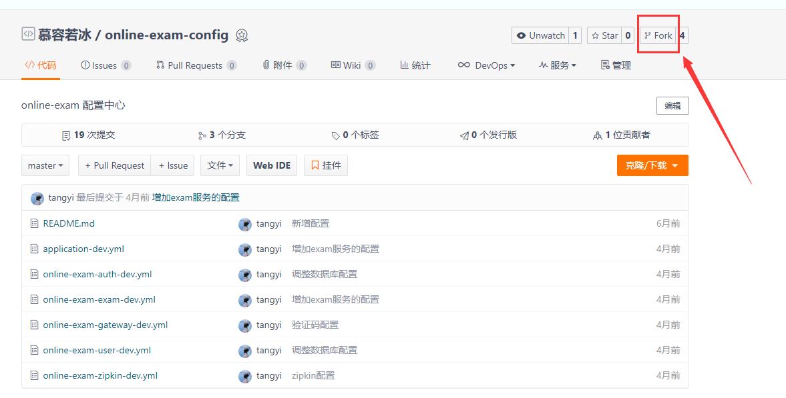
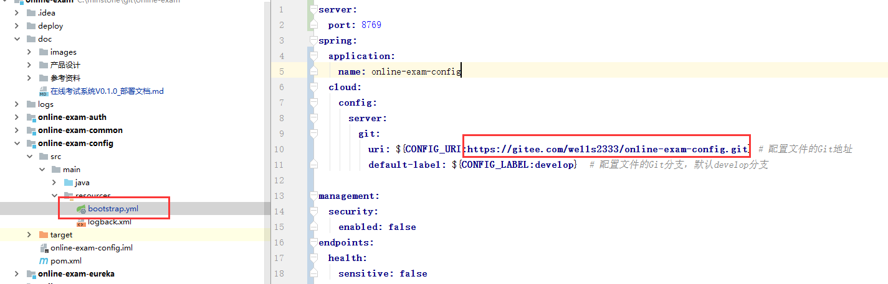
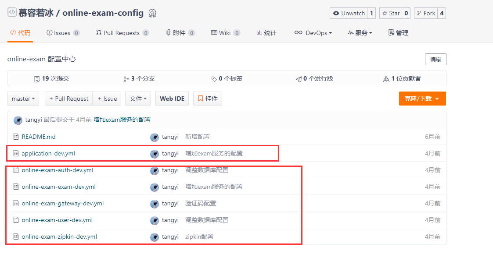
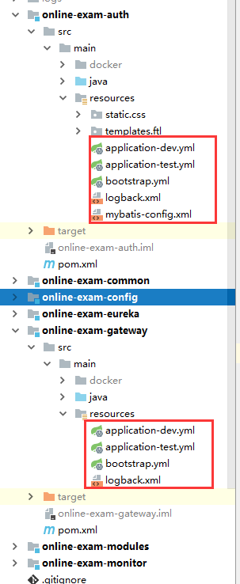
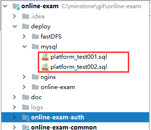
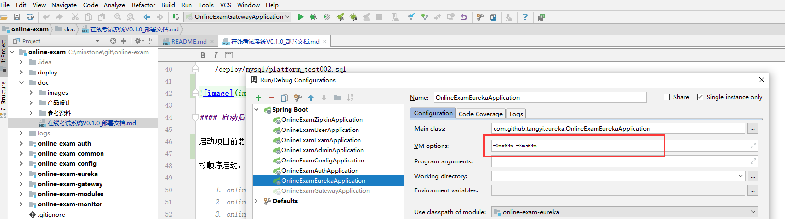
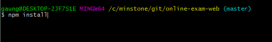
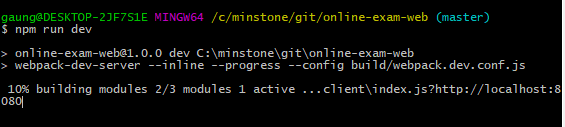
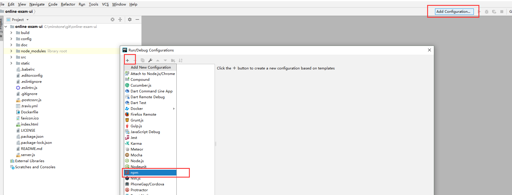
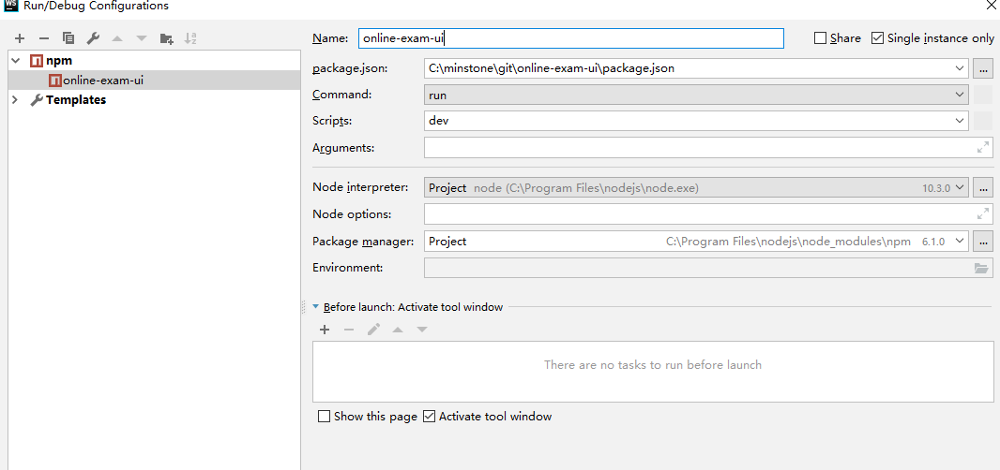

主要介绍如何在本地运行项目，包括下载、导入、修改配置、运行项目

#### 环境准备

开发环境：

- jdk：1.8
- MySQL：5.7+
- redis
- rabbitMq
- node.js

开发工具：IntelliJ IDEA、WebStorm

#### 项目下载

1. 先fork项目[online-exam-config](https://gitee.com/wells2333/online-exam-config.git)

2. git clone下载[online-exam](https://gitee.com/wells2333/online-exam.git)、[online-exam-ui](https://gitee.com/wells2333/online-exam-ui.git)、[online-exam-web](https://gitee.com/wells2333/online-exam-web.git)：

    git clone https://gitee.com/wells2333/online-exam.git
    
    git clone https://gitee.com/wells2333/online-exam-ui.git
    
    git clone https://gitee.com/wells2333/online-exam-web.git

#### 修改配置

1. 修改online-exam的online-exam-config的application-dev.yml的git uri为你的仓库地址，默认采用的分支是develop，**修改配置时要注意修改的分支**

2. 修改其它服务的配置，如数据库、redis、rabbitMq等，包括配置中心模块的application-dev.yml和各服务自己的配置和其它模块的配置

3. 运行数据库初始化脚本：

    /deploy/mysql/platform_test001.sql
    
    /deploy/mysql/platform_test002.sql
    

#### 启动后端项目

启动项目前要**先确认MySQL、redis、rabbitMq是否已经启动**

按顺序启动：

    1. online-exam-config
    2. online-exam-eureka
    3. online-exam-auth
    4. online-exam-user
    5. online-exam-exam
    6. online-exam-gateway
    
内存不足的可以限制每个服务的内存：online-exam-eureka、online-exam-config可以分配64M（-Xmx64m -Xms64m）、其它服务分配128M（-Xmx128m -Xms128m）
    
    
    
    
需要使用监控功能再启动：

    7. online-exam-zipkin
    8. online-exam-admin

#### 启动前端项目

分别在[online-exam-ui](https://gitee.com/wells2333/online-exam-ui.git)、[online-exam-web](https://gitee.com/wells2333/online-exam-web.git)目录下，命令行运行：

    npm install

    npm run dev
    
    

 

WebStorm导入项目：

 

 

运行：

 

[online-exam-web](https://gitee.com/wells2333/online-exam-web.git)项目WebStorm导入操作类似

启动成功后访问：
    
    前台：localhost:8080
        
    后台：localhost:9527

    online-exam-eureka:localhost:8765，账号：root/11
    
默认账号：

1. 管理员：admin/123456

2. 学生：student/123456

3. 教师：teacher/123456

#### 服务和端口

    注册中心（online-exam-eureka）：8765

    配置中心（online-exam-config）：8888

    认证中心（online-exam-auth）：3000

    用户服务（online-exam-user）：4000

    考试服务（online-exam-exam）：35010

    网关（online-exam-gateway）：9999

    zipkin监控（online-exam-zipkin）：9411

    服务监控（online-exam-admin）：5001